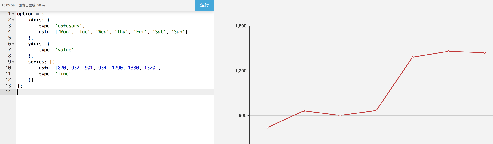

# 百度图表
详细使用请参考百度图表[官方文档](http://echarts.baidu.com/api.html#echarts)。

## 导入相关模块
需要在根模块导入模块EChartModule（**在其它任何模块中不需要导入了！**）
```typescript
import { NgModule } from '@angular/core';
import { AppRoutingModule } from './app.routing';
import { AppComponent } from './app.component';

// 需要使用EChartModule模块
import {EChartModule} from 'ng-tools-ui';

@NgModule({
    declarations: [AppComponent],
    imports: [
        ...
        // 需要提供相关js的加载路径
        EChartModule.forRoot('assets/echart/echarts.common.min.js'),
        ...
        AppRoutingModule,
    ],
    bootstrap: [AppComponent]
})
export class AppModule { }

```
## 使用指令`baseEchart`让一个div变成百度图表的容器

```html
<div baseEchart 
    [option]="options"
    style="width:100%;height:400px;">    <!-- 需要给div高宽，不然看不见图表 -->
</div>
```


@Input

名称 | 类型 | 详情
------------ | ------------- | ------------
option | any  | 图表参数，同百度图表官方示例中的option,见上图
resize | boolean  | 是否启用自适应宽度

@Output

事件名称 | 事件类型 | 详情
------------ | ------------- | ------------
chartLoad | { echartsInstance: EchartsInstance, echarts: any }  | 图表加载成功后会提供图表的实例和echarts对象
