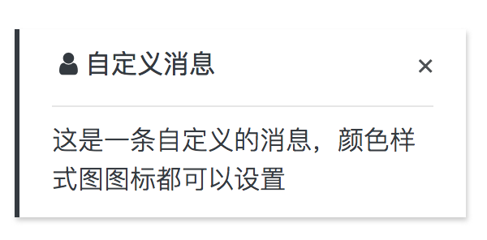

# 消息提示
通常情况下在执行一些操作时，对每次操作结果都要给予提示信息，如删除操作。

## 导入相关模块
需要在根模块导入模块ToastModule，一般的项目已经导入了（**在其它任何模块中不需要导入了！**）
```typescript
import { NgModule } from '@angular/core';
import { AppRoutingModule } from './app.routing';
import { AppComponent } from './app.component';

// 需要使用ToastModule模块
import {ToastModule} from 'ng-tools-ui';

@NgModule({
    declarations: [AppComponent],
    imports: [
        ...
        ToastModule.forRoot({
            // 消息提示出现位置（右下）
            position: 'ts-bottom ts-right', 
            // 消息显示时间4秒
            timeout: 4000, 
            // 同时出现的消息数量4条
            maxLength: 4 
        }),
        ...
        AppRoutingModule,
    ],
    bootstrap: [AppComponent]
})
export class AppModule { }

```
## 使用ToastService显示提示
在需要用到的页面组件中注入消息服务，就可以使用了

```typescript
import { Component } from '@angular/core';
// 引入消息服务
import { ToastService } from 'ng-tools-ui';

@Component({
    templateUrl: './example.component.html',
})
export class ExampleComponent {

    constructor(
        // 注入消息服务
        private toast: ToastService,
    ) { }

    showMessage(){
        this.toast.info(`提示`, '这是一条提示信息...');
    }
}
```

## ToastService 参考

### 方法

1.**info**(title: string, message: string, timer?: number)
> 显示一条信息消息

参数 | 类型 | 详情
------------ | ------------- | ------------
title | string  | 消息标题
message | string  | 消息内容
timer | number  | 消息显示时间，如果不填那么默认采用全局配置的forRoot中设置好的

2.**warning**(title: string, message: string, timer?: number)
> 显示一条警告消息

参数 | 类型 | 详情
------------ | ------------- | ------------
title | string  | 消息标题
message | string  | 消息内容
timer | number  | 消息显示时间，如果不填那么默认采用全局配置的forRoot中设置好的

3.**danger**(title: string, message: string, timer?: number)
> 显示一条危险消息

参数 | 类型 | 详情
------------ | ------------- | ------------
title | string  | 消息标题
message | string  | 消息内容
timer | number  | 消息显示时间，如果不填那么默认采用全局配置的forRoot中设置好的

4.**success**(title: string, message: string, timer?: number)
> 显示一条成功消息

参数 | 类型 | 详情
------------ | ------------- | ------------
title | string  | 消息标题
message | string  | 消息内容
timer | number  | 消息显示时间，如果不填那么默认采用全局配置的forRoot中设置好的

5.**create**(
    title: string, 
    message: string, 
    options: { color: string, icon: string, timeout?: number }
)
> 显示一条自定义配置的消息

参数 | 类型 | 详情
------------ | ------------- | ------------
title | string  | 消息标题
message | string  | 消息内容
options |  Object | 相关配置参数,color为消息的颜色样式类如'border-info',icon要显示的为图标样式，timeout为显示时间

用例
```typescript
this.toast.create(
    '自定义消息',
    '这是一条自定义的消息，颜色样式图图标都可以设置',
    {
        color: 'border-dark',
        icon: 'fa-user text-dark',
        timeout: -1, // -1为永不消失
    }
);
```


